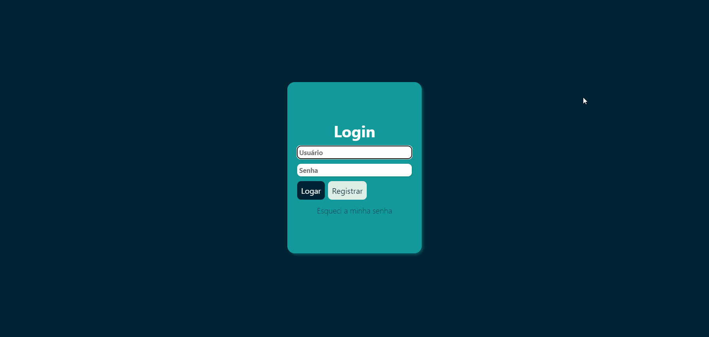
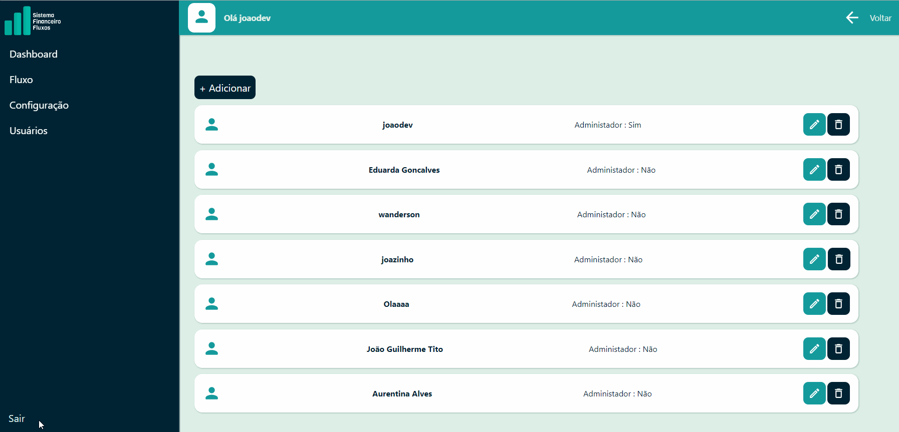
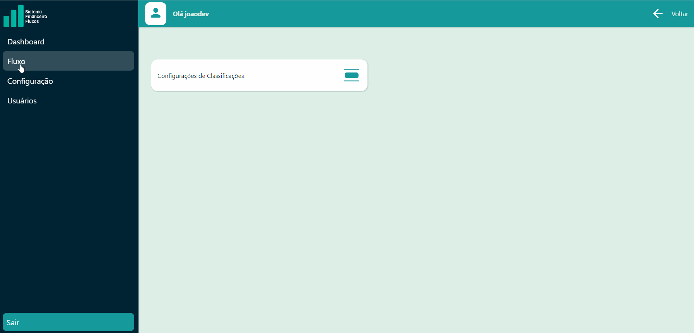
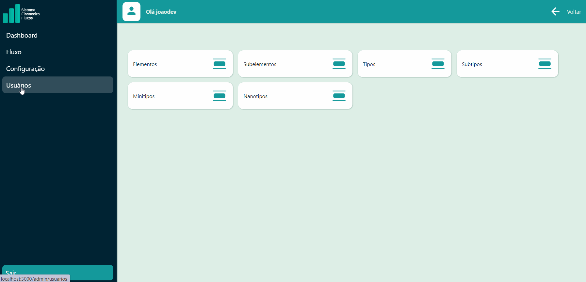
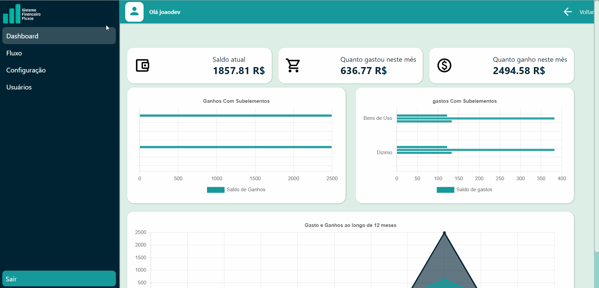
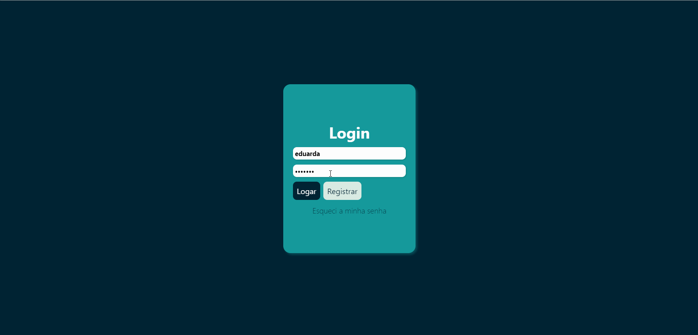

 

<h1>Fluxos Frontend</h1>

Estas são as tela do sistema de financas pessoais Fluxos, separei a aplicação em dois repositorio para melhor organização do projeto.

<h2> Indice 🗂️</h2>

 <li> <a href="#edicoes">1 - 🪡Edições</a> •</li>
 <li> <a href="#introdução">1 - 🚪Introdução</a> •</li>
 <li> <a href="#tech">2 - ⚙️ Tech Usadas</a> • </li>
 <li> <a href="#instalar">3 - 👇🤘 Como instalar</a> • </li>
 <li> <a href="#usar">4 - 🤘Como Usar</a> • </li>
 <li> <a href="#consideraçoesfinais">5 - Considerações finais </a> • </li>
 <li> <a href="#outros">6 -📁😅🤪 Coisa não tão relevantes</a> • </li>
 <li> <a href="#autor">7 -🧑‍💻 Autor</a> • </li>
 <li> <a href="#licensa"> 8- Licença</a> • </li>

<h2 id='edicoes'>Edições 🪡</h2>

Alterações   | Data | Versão
:---------: | :------: | :------:
Emissão Inicial | 05/09/2022 | 1.0.0

<h2 id='introdução' color=green ><b>Introdução🚪</b></h2>

Este sistema tem o intuito organizar as minhas finanças pessoais, baseado em uma planilha de uso posterior por mim, foca na organização com base nas necessidades do usuário, usando das classificações para separação gastos e lucros do usuário.

<h2 id='tech' ><b>Techs Usadas 🦾</b></h2>

**• Typescript**
**• React**
**• Styled-Components**
**• Redux**
**• Axios**
**• ReactChats-2**

<h2 id='instalar'><b>3- Como instalar 🧑‍🔧</b></h2>

1. Instale o Backend. <a href='https://github.com/JoaoG23/Fluxos-API#readme'>Clique aqui para ver como instalar!</a>
2. Clone o sistema.
3. Abra o terminal na pasta raiz.
4. Digite um npm install.
5. Volte no terminal e digite npm run build
6. A pasta build será criada. Basta usar um servidor para teste Tipo live server ou npm start para testa o servidor.

O próprio node.

<h2 id='usar'><b>4- Como usar 👩‍💻</b></h2>

Crie um usuário e senha.

Na tela inicial clique e registre.

Em seguida faça login com sua senha e usuário.

Explicando as telas do Sistema.🤔😁

#### Dashboard mostrando alguns dados.

**Mês atual** 📅

Mostra dados relevante logo no inicio da aplicacão esses dados são servidos alguns com gráficos para melhor visualização destes. Eles são:

• Ganhos
• Gastos
• Saldo Atual
• Ganhos por subelementos 
• Gasto por subelementos

**Subelemento** vem da minha classifição, na contabilidade existe 2 elementos chamados de **ATIVOS E PASSIVO**, assim, vendo isso eu criei a legenda subelemento que, simbolizando uma classificação abaixo dos elementos. Sendo eles, Bens de uso, bens de consumo ou lazer entre outras coisa.

**Do Ano**
Demostrando os Gasto e Ganhos ao longo de 12 meses

#### Fluxo de Caixa 💸

Manipula os gastou e ganhos do fluxo de caixa dando, podendo adicionar, deletar, editar, e classificar, tudo bem intuitivo uso para os usuáros da aplicação 

#### Configurações 🪛

Tem algumas classifições serve para organização dos dados do fluxo de caixa com local, tipo de elemento passivo ou ativo, entre outras coisa...

Elas serão usadas no fluxo de caixa ao adicionar um novo item.

#### Usuários 🚶‍♂️

Gerencia os usuários da aplicação. Lista todos os usuários
Importante ressaltar que foram criados dois tipos de usuários os administradores, com acesso a todos os privilégios e comum, sendo que o comum somente tem acesso a tela inicial dashboard.

#### Usuário Logado 🙋🏽‍♂️

Mostra dados do usuário logado presente nesse momento.

Os usuários podem sem **admin ou não admin**, administradores podem ver todas as telas, já usuários **comuns** somente podem ver somente o **dashboard.**

<h2 id='consideraçoesfinais'><b>5 -🥺😭 Considerações finais</b></h2>
Ainda tem alguns bugs que não conseguir resolver do react, mas vou trabalhar nisso.

Esse projeto foi com trazer o que já foi consolidado anos atrás com uma planilha de Excel pra web,😓😒 porém tive a infelicidade de isso não dar muito certo, devido o tipo de modo que foi desenvolvido a aplicação. Não pude nem escalar e mais nem o hospedar para possível demonstração prática para todos. Se quiserem mais detalhes disso basta entrar em contato comigo no LinkedIn ou no e-mail.
Enfim,😉 no mais ela ficou sendo uma aplicação desktop mesmo... futuramente irei refatorá-la para e gerar um ou novo programa ou atualizar o existente. Obrigado pela atenção de todos.

<h2 id='autor'><b>8 - Autor ✍🏻</b></h2>

 
  
 <b>Joao Guilherme</b></a> <a href="https://github.com/JoaoG23/">🚀</a>

Feito com 🤭 por Joao Guilherme 👋🏽 Entre em contato!

<h2 id='licenca'><b>8 - Licença</b></h2>

